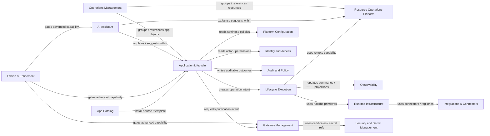

# AppOS DDD Architecture

## Status
Draft

## Intent
This document defines the current DDD view of AppOS for product evolution, backend refactoring, and iteration planning.

AppOS should be understood as a single-server-first application lifecycle platform with a path to coordinated multi-server operation, not merely a Docker console, server toolbox, or settings shell.

This ADR is intentionally domain-centered.

- System topology, runtime stack, and deployment choices remain in the main architecture document.
- Product surfaces, navigation groupings, and technical mechanisms are documented in the PRD and should not be confused with bounded contexts.

## 1. Subdomain Classification

| Domain | Type | Purpose | Representative roots / objects |
| --- | --- | --- | --- |
| Application Lifecycle | Core | Manage one application through install, run, change, publish, recover, and retire | `AppInstance`, `Operation`, `Release`, `Exposure`, `RecoveryPlan`, `AppTopology` |
| Lifecycle Execution | Supporting | Execute lifecycle intent through pipelines, workers, dispatch, compensation, and projections | `PipelineRun`, `CompensationPlan` |
| Resource Operations Platform | Supporting | Provide terminal, file, service, container, and remote access operations across targets | `Server`, `TerminalSession`, `RemoteFileSession`, `ServiceTarget`, `RuntimeContainer` |
| Observability | Supporting | Provide telemetry, health, diagnostics, and platform self-observation | `TelemetryStream`, `HealthCheckSet`, `PlatformStatusSnapshot` |
| Operations Management | Supporting | Organize resources, operational knowledge, incidents, and procedures | `ResourceGroup`, `Topic`, `KnowledgeDocument`, `Incident`, `Procedure` |
| App Catalog | Supporting | Provide catalog apps, custom apps, templates, favorites, and notes | `CatalogApp`, `CustomApp`, `Template`, `UserCatalogState` |
| Gateway Management | Supporting | Manage shared domain binding, routing, certificates, and gateway policy | `DomainBinding`, `GatewayRoute`, `CertificateBinding`, `GatewayPolicy` |
| Runtime Infrastructure | Supporting | Provide runtime projects, recovery artifacts, and configuration assets | `RuntimeProject`, `BackupSnapshot`, `IaCWorkspace` |
| Integrations & Connectors | Supporting | Manage source, registry, notification, AI provider, and external identity integrations | `SourceConnector`, `RegistryConnector`, `NotificationConnector`, `AIProvider`, `IdentityConnector` |
| AI Workflow / Agent Automation | Supporting | Define skills, task plans, guided automation, and specialized agents | `Skill`, `TaskPlan`, `GuidedFlow`, `AgentProfile` |
| Edition & Entitlement | Supporting | Define edition model, licensing, subscriptions, and feature entitlements | `Edition`, `License`, `Subscription`, `Entitlement` |
| Platform Configuration | Generic | Manage settings schema and platform-scoped configuration entries | `SettingEntry`, `SettingSchema` |
| Identity and Access | Generic | Manage setup, users, sessions, and access grants | `User`, `Session`, `AccessGrant` |
| Security and Secret Management | Generic | Manage secrets and policies that govern secret use or reveal behavior | `Secret`, `SecretPolicy` |
| Audit and Policy | Generic | Record auditable events and policy decisions | `AuditEntry`, `PolicyDecision` |
| AI Assistant | Cross-cutting capability | Provide embedded suggestions, explanations, guidance, and assistant sessions across surfaces | `AssistantSession`, `SuggestionSession`, `ExplanationRequest`, `GuidanceCard` |

### Interpretation

1. `Application Lifecycle` is the only core domain.
2. `Lifecycle Execution` realizes lifecycle behavior but does not own product meaning by itself.
3. `Gateway Management` is distinct from lifecycle exposure intent; it owns shared routing, certificate, and gateway policy concerns.
4. `Resource Operations Platform` is distinct from `Operations Management`; one provides operational action surfaces, the other organizes knowledge, relationships, and procedures.
5. `Observability` is a first-class supporting domain rather than a leftover runtime concern.
6. `Integrations & Connectors` should not be hidden under generic settings or runtime configuration.
7. `Workspace`, `Admin`, `Dashboard`, `Resources`, `System`, and `Settings` are product surfaces or navigation containers, not domains.
8. `CLI`, `Cron`, `Worker`, `Queue`, `Projection`, and `Domain Event` are mechanisms, not domains.

## 2. Bounded Context Map

### Context Boundaries

| Bounded Context | Owns | Does not own |
| --- | --- | --- |
| Application Lifecycle | app identity, lifecycle intent, desired state, release baseline, exposure intent, recovery intent, topology intent | terminal sessions, docker command details, gateway route policy internals |
| Lifecycle Execution | pipeline progression, node execution, dispatch, compensation, projection update triggers | long-lived app business meaning, product-facing navigation |
| Resource Operations Platform | remote connection, shell, file, service, container action targets | lifecycle release meaning, incident semantics, gateway policy |
| Observability | telemetry streams, health summaries, diagnostics, platform self-observation views | lifecycle ownership, operational procedures |
| Operations Management | grouping, inventory references, knowledge artifacts, incident coordination, procedures | server shell semantics, runtime mutation primitives |
| App Catalog | install source metadata, templates, custom app definitions, favorites, notes | installed app lifecycle state |
| Gateway Management | domain binding, route policy, upstream mapping, certificate attachment, gateway views | app runtime lifecycle state, generic secret storage |
| Runtime Infrastructure | runtime workspace, compose/runtime assets, backup artifacts, configuration assets | product-facing lifecycle decisions, shared gateway policy |
| Integrations & Connectors | external provider connections and connector metadata | product lifecycle state, generic settings presentation |
| AI Workflow / Agent Automation | automation plans, skills, guided flows, agent profiles | baseline lifecycle state, direct entitlement policy |
| Edition & Entitlement | edition definition, activation, subscription, feature gating | product workflow semantics themselves |
| Platform Configuration | schema-driven settings and platform-scoped configuration entries | secret payload semantics, app lifecycle orchestration |
| Identity and Access | actors, sessions, access grants | app-specific business behavior |
| Security and Secret Management | secret payload ownership, reveal policy, access modes | gateway routing rules, lifecycle release meaning |
| Audit and Policy | audit entries, policy decisions, policy events | operational execution ownership |
| AI Assistant | assistant session and suggestion/explanation artifacts | business ownership of lifecycle, gateway, or resource state |

### Integration Rules

1. `Application Lifecycle` remains the orchestration owner for application business behavior.
2. `Lifecycle Execution` executes commands and updates projections, but it does not redefine domain ownership.
3. `Gateway Management` is the owner of shared routing and certificate policy, even when lifecycle surfaces summarize publication state.
4. `Resource Operations Platform` provides operational actions and target access, but does not own app lifecycle meaning.
5. `Operations Management` may reference and group resources from other domains without becoming the owner of every resource body.
6. `Runtime Infrastructure` exposes runtime and recovery primitives; it should not become the primary product API surface.
7. `Integrations & Connectors` owns provider connections; platform settings may present them, but should not absorb their domain identity.
8. `AI Assistant` is cross-cutting and must attach to other contexts rather than replacing them.

## 3. Aggregate Design

This section captures lightweight aggregate boundaries aligned with the current PRD. It is not intended to freeze persistence design.

## 3.1 Application Lifecycle Context

| Aggregate | Root | Boundary | Invariants |
| --- | --- | --- | --- |
| App Instance | `AppInstance` | One installed or managed application in lifecycle scope | one canonical lifecycle state; one desired state; references current release and primary exposure summary |
| Operation | `Operation` | One requested lifecycle action and its outcome | one operation has one type, one terminal result, and optional one execution graph |
| Release | `Release` | One immutable release or configuration baseline | release baseline is append-only after creation except activation markers |
| Exposure | `Exposure` | One app-facing publication intent | publication summary is independent from runtime health and may reference gateway-owned bindings |
| Recovery Plan | `RecoveryPlan` | One recovery or rollback intent boundary | recovery path must resolve to one target state or baseline |
| App Topology | `AppTopology` | One app-level topology definition across roles or nodes | topology assignments must remain internally consistent for one logical app |

Boundary rules:

1. `AppInstance` owns long-lived lifecycle meaning.
2. `Operation` owns execution intent and terminal result, not app business identity.
3. `Release` owns rollback-safe baseline information, not running status.
4. `Exposure` owns app-facing publication intent, not shared gateway route policy.
5. `RecoveryPlan` and `AppTopology` remain lifecycle-owned as long as they describe one application's managed behavior.

## 3.2 Lifecycle Execution Context

| Aggregate | Root | Boundary | Invariants |
| --- | --- | --- | --- |
| Pipeline Run | `PipelineRun` | One execution graph for one lifecycle operation | belongs to exactly one `Operation` |
| Compensation Plan | `CompensationPlan` | One compensation or resume strategy for interrupted execution | compensation steps must align to one failed or partial execution context |

Boundary rules:

1. Worker scheduling and projection update are internal mechanisms, not separate business aggregates.
2. `PipelineRun` is internal execution state, not product lifecycle state.
3. Node runs are internal entities inside pipeline execution, not product roots.

## 3.3 Resource Operations Platform Context

| Aggregate | Root | Boundary | Invariants |
| --- | --- | --- | --- |
| Server | `Server` | One managed operation target | connection identity and access capability remain consistent together |
| Terminal Session | `TerminalSession` | One interactive shell session | ephemeral session bound to one target and one execution context |
| Remote File Session | `RemoteFileSession` | One file-operation context for a target | file actions must resolve against one target capability and scope |
| Service Target | `ServiceTarget` | One service-oriented operation target | actions and status belong to one identified service target |
| Runtime Container | `RuntimeContainer` | One container-oriented operation target | operational actions must remain tied to one runtime identity |

## 3.4 Observability Context

| Aggregate | Root | Boundary | Invariants |
| --- | --- | --- | --- |
| Telemetry Stream | `TelemetryStream` | One telemetry source or stream family | events, logs, or metrics remain attributable to one source scope |
| Health Check Set | `HealthCheckSet` | One coherent set of checks for a target scope | summary state must be derivable from its checks |
| Platform Status Snapshot | `PlatformStatusSnapshot` | One point-in-time platform self-observation summary | snapshot fields must describe one observation horizon |

## 3.5 Operations Management Context

| Aggregate | Root | Boundary | Invariants |
| --- | --- | --- | --- |
| Resource Group | `ResourceGroup` | One grouping / ownership boundary over referenced resources | membership and ownership bindings must be internally consistent |
| Topic | `Topic` | One operational discussion thread | comments and references belong to one topic identity |
| Knowledge Document | `KnowledgeDocument` | One managed operational document | folder placement and attachments belong to one document identity |
| Incident | `Incident` | One incident coordination boundary | status, alert linkage, and escalation path belong to one incident |
| Procedure | `Procedure` | One deterministic operational procedure definition | procedure steps must define one coherent automation or runbook boundary |

Boundary rules:

1. `ResourceGroup` references resources owned by other domains; it does not replace their domain ownership.
2. Operational knowledge and incidents are first-class business objects, not merely UI tabs.

## 3.6 App Catalog Context

| Aggregate | Root | Boundary | Invariants |
| --- | --- | --- | --- |
| Catalog App | `CatalogApp` | One installable catalog item | source metadata and install definition remain coherent |
| Custom App | `CustomApp` | One user-authored install definition | ownership and visibility must be explicit |
| Template | `Template` | One reusable install or starter template | versioned template input structure must remain consistent |
| User Catalog State | `UserCatalogState` | One user's catalog preferences for one target app | favorites and notes remain scoped to one user/app pair |

## 3.7 Gateway Management Context

| Aggregate | Root | Boundary | Invariants |
| --- | --- | --- | --- |
| Domain Binding | `DomainBinding` | One hostname-to-target binding boundary | one binding must resolve to one scope and one hostname policy |
| Gateway Route | `GatewayRoute` | One shared route / upstream definition | route target and upstream mapping must remain internally consistent |
| Certificate Binding | `CertificateBinding` | One certificate attachment policy boundary | certificate reference and attachment scope must remain consistent |
| Gateway Policy | `GatewayPolicy` | One reusable publish or routing policy | policy rule set must remain coherent inside one policy object |

Boundary rules:

1. Shared routing policy belongs here even when `App Detail` displays a summarized view.
2. Gateway views are projections, not aggregates.

## 3.8 Runtime Infrastructure Context

| Aggregate | Root | Boundary | Invariants |
| --- | --- | --- | --- |
| Runtime Project | `RuntimeProject` | One compose/runtime workspace | runtime files and project identity remain scoped together |
| Backup Snapshot | `BackupSnapshot` | One recovery artifact | immutable once created |
| IaC Workspace | `IaCWorkspace` | One managed IaC/configuration workspace | file hierarchy and workspace identity remain scoped together |

## 3.9 Integrations & Connectors Context

| Aggregate | Root | Boundary | Invariants |
| --- | --- | --- | --- |
| Source Connector | `SourceConnector` | One source provider connection | credential and repository binding scope remain coherent |
| Registry Connector | `RegistryConnector` | One artifact or registry connection | provider endpoint and credential reference stay coherent |
| Notification Connector | `NotificationConnector` | One delivery integration boundary | endpoint and delivery mode belong together |
| AI Provider | `AIProvider` | One model provider connection | endpoint, model scope, and credential reference must remain coherent |
| Identity Connector | `IdentityConnector` | One external identity or federation bridge | provider type and federation binding must remain coherent |

## 3.10 Generic and Cross-Cutting Contexts

| Context | Root | Boundary |
| --- | --- | --- |
| Platform Configuration | `SettingEntry` | One platform-scoped setting entry or schema-governed configuration item |
| Identity and Access | `User` | One actor and access identity boundary |
| Security and Secret Management | `Secret` | One secret payload ownership boundary |
| Security and Secret Management | `SecretPolicy` | One secret usage / reveal policy boundary |
| Audit and Policy | `AuditEntry` | One auditable fact boundary |
| Edition & Entitlement | `Edition`, `License`, `Subscription`, `Entitlement` | One capability-gating boundary per root object |
| AI Assistant | `AssistantSession` | One embedded assistant interaction boundary |

## Domain Boundary Summary

1. App lifecycle decisions start in `Application Lifecycle`.
2. Execution state lives in `Lifecycle Execution`.
3. Shared publication infrastructure belongs to `Gateway Management`, not to generic runtime tooling.
4. Remote operational capability comes from `Resource Operations Platform`.
5. Inventory, grouping, knowledge, incidents, and procedures belong to `Operations Management`.
6. Runtime and recovery primitives belong to `Runtime Infrastructure`.
7. External providers belong to `Integrations & Connectors`.
8. Platform settings, IAM, secrets, audit, and entitlements remain generic or cross-cutting support contexts.

## Current Design Choice

For the current stage of AppOS, the system should optimize for this path:

`Catalog or manual input -> Lifecycle intent -> Operation -> Pipeline execution -> Runtime mutation -> Projection update -> Product surface summary`

This keeps the business center on `AppInstance` and its related lifecycle roots, not on Docker commands, raw server sessions, or UI navigation containers.