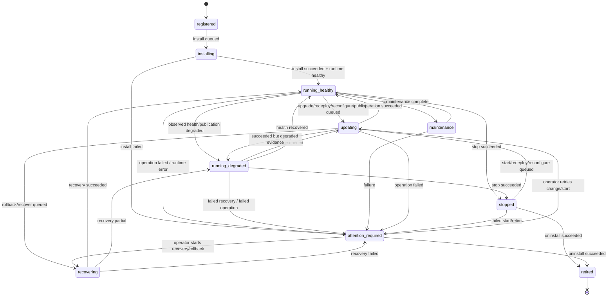
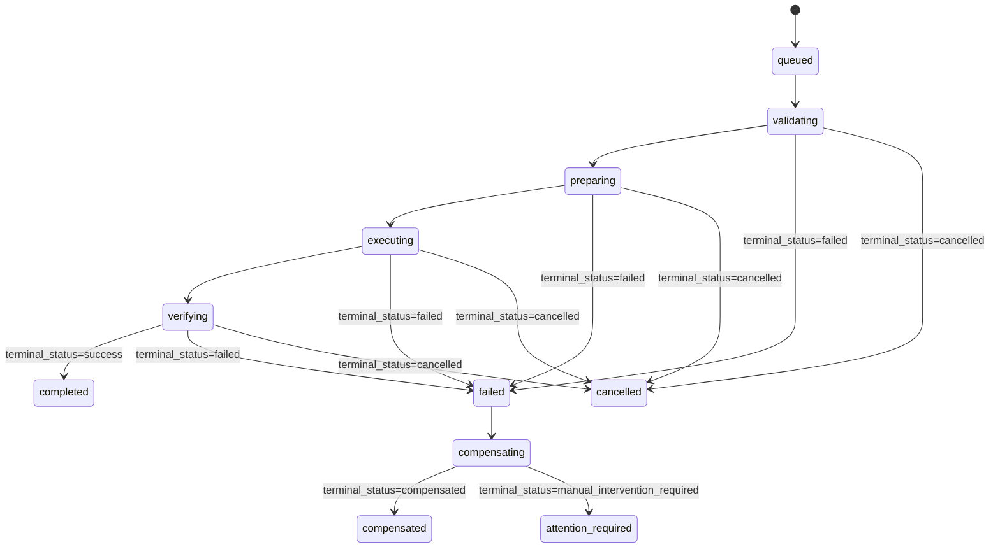
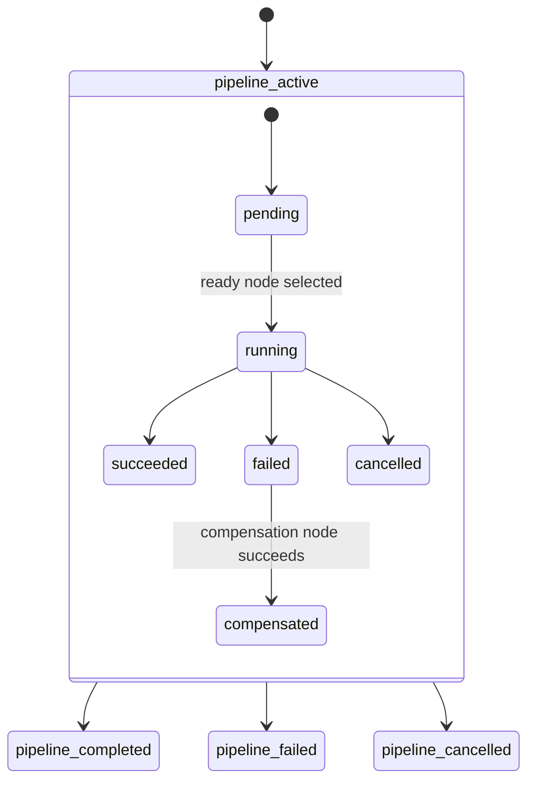
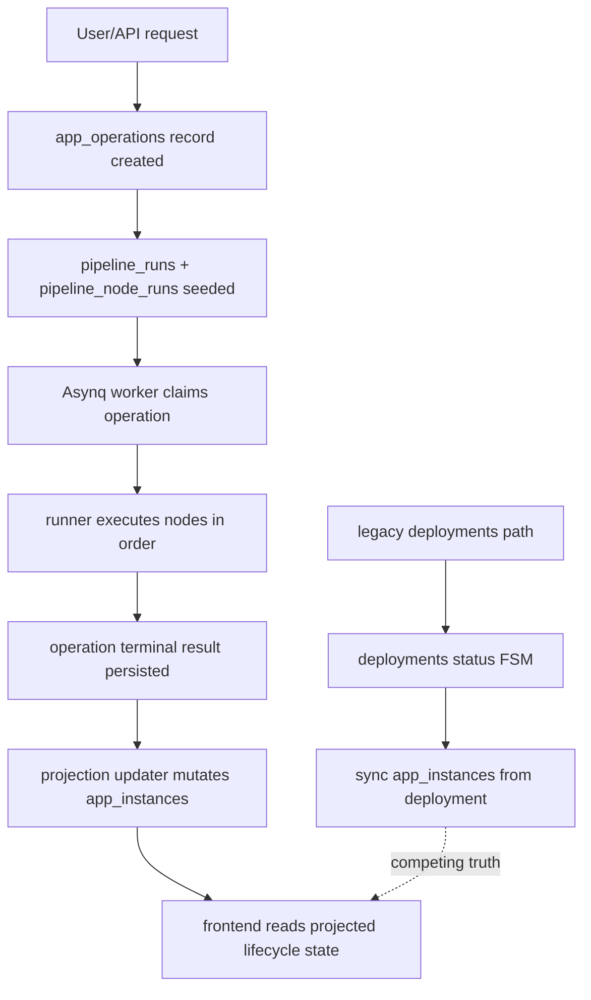
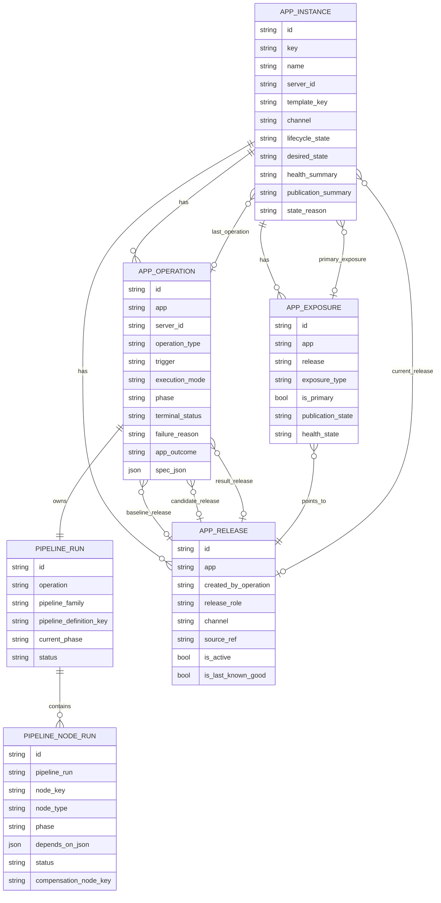
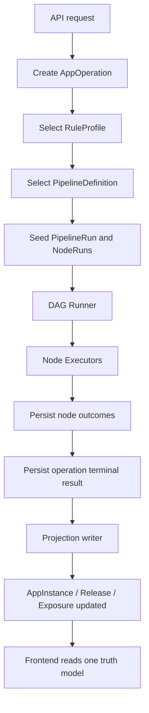

# AppOS Deployment Architecture Assessment

## Scope

This document captures:

1. the **current real** deployment state model in the codebase
2. the **current real** deployment object relationships
3. the main architecture inconsistencies
4. the convergence roadmap for the next optimization round

This assessment assumes the following architectural decisions are now fixed:

- remove legacy `deployments` as a canonical model
- make `app_operations + pipeline_runs + pipeline_node_runs` the only execution truth
- position the runner as a true dependency-aware DAG runner
- simplify projection logic so it resolves state from canonical facts instead of compensating for model ambiguity
- materialize `RuleProfile` as a first-class strategy mechanism

---

## Current Real Deployment State Machine

The codebase currently has **two coexisting execution tracks** plus one projection layer.

### 1. Product-facing lifecycle state machine

Canonical owner: `app_instances.lifecycle_state`

Source:

- `backend/domain/lifecycle/model/vocabulary.go`
- `backend/domain/lifecycle/projection/updater.go`
- `backend/domain/lifecycle/projection/app_instance_state.go`

### 2. Operation execution state machine

Canonical owner: `app_operations`

Source:

- `backend/infra/schema/app_operations.go`
- `specs/adr/app-lifecycle-domain-model.md`

This model is intentionally split across **phase**, **terminal_status**, and **failure_reason**.

Notes:

- the schema already supports the split model
- the worker flow mostly follows it
- not every compensation path is fully implemented yet

### 3. Pipeline execution state machine

Canonical owners:

- `pipeline_runs`
- `pipeline_node_runs`

Source:

- `backend/infra/schema/pipeline_runs.go`
- `backend/infra/schema/pipeline_node_runs.go`
- `backend/domain/lifecycle/orchestration/runner.go`

Important implementation reality:

- the schema models a DAG
- the current runner is still effectively **ordered-node sequential execution**, not a full ready-set DAG scheduler

### 4. Current real combined runtime picture

The last branch is the main source of architectural ambiguity today.

---

## Current Real Object Relationship Diagram

Source:

- `backend/infra/schema/app_instances.go`
- `backend/infra/schema/app_operations.go`
- `backend/infra/schema/pipeline_runs.go`
- `backend/infra/schema/pipeline_node_runs.go`
- `backend/infra/schema/app_releases.go`
- `backend/infra/schema/app_exposures.go`

### Current ownership model

| Concern | Canonical owner | Notes |
| --- | --- | --- |
| long-lived app state | `AppInstance` | product-facing truth |
| requested action | `AppOperation` | one business request |
| execution graph | `PipelineRun` | instantiated pipeline definition |
| node execution | `PipelineNodeRun` | smallest observable unit |
| rollback/promote baseline | `AppRelease` | release and last-known-good truth |
| publication/exposure | `AppExposure` | external access truth |

This ownership model is good. The main problem is not the model. The problem is the remaining competing path.

---

## Current Architecture Inconsistencies

### 1. Two competing execution models still exist

Files:

- `backend/domain/deploy/deploy.go`
- `backend/infra/schema/deployments.go`
- `backend/domain/worker/worker.go`
- `backend/domain/worker/lifecycle_operations.go`

Problem:

- lifecycle operations are modeled through `app_operations + pipeline_runs`
- legacy deployment execution is still modeled through `deployments`
- both can influence `app_instances`

Impact:

- multiple truth sources for one app state
- duplicated execution semantics
- migration and debugging complexity

### 2. The code says DAG, but the runner behaves like a linear staged pipeline

File:

- `backend/domain/lifecycle/orchestration/runner.go`

Problem:

- the schema supports dependency edges via `depends_on_json`
- node definitions support `depends_on`
- the runner currently loops over `Definition.Nodes` in order and executes one by one

Impact:

- no real ready-node scheduling
- no parallel branches
- no honest support for wait/manual-gate semantics
- DAG is partially representational, not yet behavioral

### 3. Projection is doing too much semantic repair

File:

- `backend/domain/lifecycle/projection/app_instance_state.go`

Problem:

- it normalizes runtime strings, monitor signals, publication states, pipeline activity, and lifecycle meaning together
- it acts both as resolver and compensator for upstream inconsistency

Impact:

- hard-to-explain derived states
- difficult debugging when one bad signal contaminates the final projection
- increased risk of hidden policy in projection code

### 4. RuleProfile exists in ADRs, but not as a fully materialized runtime mechanism

Files:

- `specs/adr/app-lifecycle-domain-model.md`
- `specs/adr/app-lifecycle-pipeline-execution-engine.md`

Problem:

- pipeline selection and behavior still lean on direct branching and implicit conventions
- validation, compensation, publication, retry, and manual-gate policy are not yet unified behind a runtime strategy object

Impact:

- every new app/source/risk combination tends to create more conditionals
- hard to scale behavior cleanly across compose/build/local/remote variations

### 5. Orphan, resume, retry, and compensation semantics are not yet unified

Files:

- `backend/domain/worker/lifecycle_operations.go`
- `backend/domain/lifecycle/orchestration/runner.go`

Problem:

- restart/orphan handling is conservative and mostly correct
- but waiting, retry, resume, compensation, and manual intervention semantics are not yet governed by one consistent policy surface

Impact:

- safe behavior now, but limited future flexibility
- hard to reason about when automation should stop versus continue

---

## Convergence Direction

The next architecture should converge to this shape:

Principles:

1. `AppOperation` is the only operation truth.
2. `PipelineRun` is the only execution truth.
3. `AppInstance` is a projection, not an in-flight worker scratchpad.
4. `Projection` only resolves from canonical facts.
5. `RuleProfile` owns policy selection.
6. No legacy deployment record participates in lifecycle truth.

---

## Convergence Roadmap

## Phase 1: Kill the legacy deployment path first

Priority: **highest**

Goal:

- remove `deployments` from all canonical execution paths
- stop `deployments` from mutating `app_instances`

Actions:

1. remove API entry points that create `deployments`
2. move all install/start/stop/redeploy flows to `app_operations`
3. remove `syncAppInstanceFromDeployment` style projection writes
4. delete `backend/domain/deploy/deploy.go` state machine from active runtime use
5. remove `backend/infra/schema/deployments.go` from the canonical model and migration path

Done when:

- every deployment-like action creates exactly one `app_operation`
- every UI screen reads from lifecycle objects only
- no background worker can transition app state through `deployments`

Why first:

- every later cleanup is blocked while two truth systems coexist

## Phase 2: Turn the pipeline runner into a real DAG runner

Priority: **highest**

Goal:

- make runtime behavior match the metadata contract

Actions:

1. replace ordered-node `for` execution with ready-set scheduling
2. compute node readiness from `depends_on`
3. add explicit node terminal vocabulary for `waiting`, `manual_gate`, `skipped`, `compensated`
4. support phase progression from actual node completion, not array order
5. allow bounded parallel execution only where nodes are independent and server-safe
6. persist deterministic continuation points for resume/retry

Done when:

- the runner no longer relies on declaration order as execution order
- a pipeline definition can express real branches without hidden control flow in executors

Why second:

- the current architecture already stores DAG metadata; the runner is the missing behavioral core

## Phase 3: Simplify and harden projection inputs

Priority: **high**

Goal:

- make projection a pure resolver over trusted facts

Actions:

1. define one canonical evidence contract for runtime, health, and publication
2. move string normalization closer to signal ingestion boundaries
3. reduce projection-side guessing of activity from loosely shaped maps
4. make `AppProjectionSources` typed instead of map-heavy where possible
5. separate `state_reason` generation from lifecycle-state resolution logic

Done when:

- projection reads normalized facts from explicit sources
- debugging a state means tracing one fact source, not a chain of fallbacks

Why third:

- once the execution path is unified, projection cleanup becomes much easier and safer

## Phase 4: Materialize RuleProfile as a first-class runtime selector

Priority: **high**

Goal:

- centralize strategy selection instead of scattering behavior in conditionals

Actions:

1. define persisted or generated `RuleProfile` shape
2. make pipeline selection depend on `operation_type + source + target + risk + rule_profile`
3. move retry, compensation, manual-gate, health-check, and publication strategy into the profile
4. define a small initial profile matrix instead of over-generalizing

Done when:

- adding a new deployment mode changes metadata/profile selection first, not worker branching first

Why fourth:

- it is the scaling mechanism for future diversity of app types and execution modes

---

## What To Change First In The Next Optimization Round

If only one workstream starts now, start here:

### Workstream A: canonical execution collapse

Order:

1. freeze legacy `deployments` creation
2. route all install-related API paths to `app_operations`
3. delete lifecycle writes sourced from legacy deployment workers
4. update frontend lists/details to read lifecycle tables only

This produces the biggest clarity gain per unit of change.

### Workstream B: DAG runner upgrade

Immediately after A:

1. redesign `orchestration.Run()` around ready-node selection
2. make node dependency state persisted and authoritative
3. add explicit pause/manual-gate/wait states before expanding pipeline variety

This turns the execution engine from “pipeline with DAG-shaped metadata” into a real orchestrator.

### Workstream C: projection cleanup

After A and B:

1. define canonical runtime evidence sources
2. reduce projection fallback heuristics
3. keep product-facing lifecycle state stable while simplifying internals

### Workstream D: rule-profile introduction

After the execution core is stable:

1. implement a minimal rule-profile registry
2. wire pipeline selection and compensation policy through it
3. use it to absorb future variability instead of adding more worker branching

---

## Bottom Line

The current AppOS lifecycle model is conceptually strong. The main issue is not the domain model. The main issue is that the runtime still reflects a transition state between:

- a legacy deployment executor
- and a newer lifecycle-oriented orchestration architecture

The highest-value next move is therefore:

1. remove legacy `deployments` as truth
2. make the pipeline runner a real DAG runner
3. simplify projection into a resolver over canonical facts
4. promote `RuleProfile` into the strategy layer

That sequence gives AppOS one consistent technical paradigm:

**declarative lifecycle orchestration driven by operation records, DAG execution, release baselines, and projection-based product state.**
