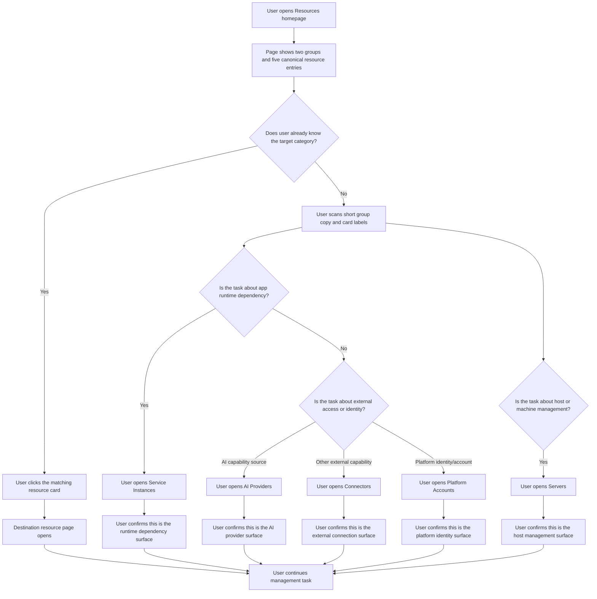
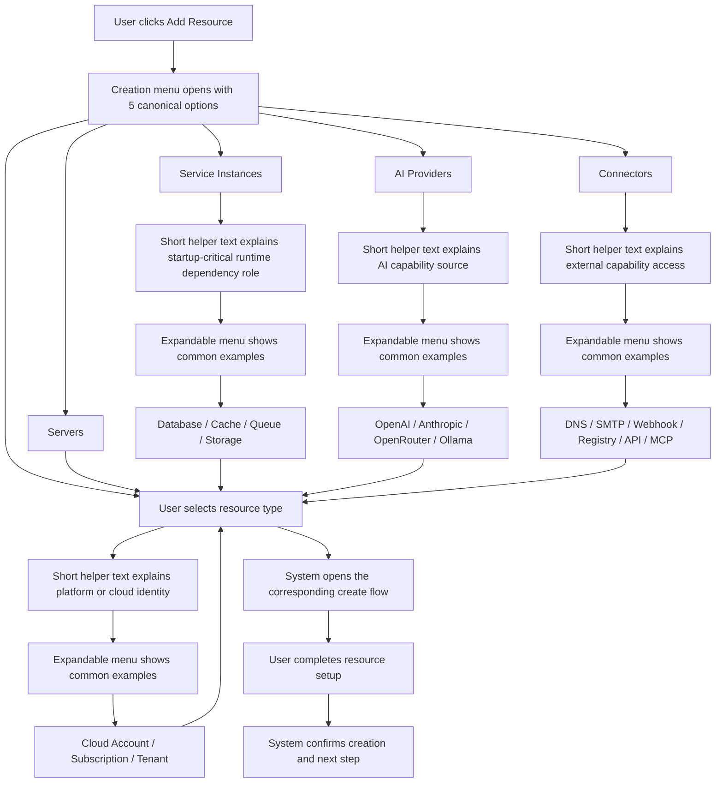
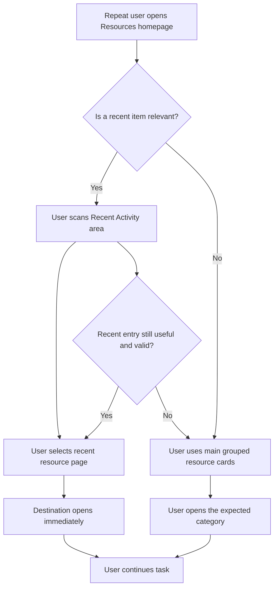

# UX Design Specification appos

**Author:** Websoft9
**Date:** 2026-04-11

---

<!-- UX design content will be appended sequentially through collaborative workflow steps -->

## Executive Summary

### Project Vision

AppOS is a single-server-first app operations and lifecycle platform. From a UX perspective, the Resources homepage should not behave like a raw inventory index. It should work as a resource map that helps operators understand where applications run, what shared services they depend on, and how AppOS connects to external services and platforms.

For the current Resources homepage work, the design goal is to preserve Epic 8's canonical five-family taxonomy while presenting it through a simpler, more task-aligned information architecture. The homepage should reduce classification ambiguity for novice and intermediate operators without weakening the canonical labels used by the deeper resource pages.

### Target Users

The primary users are independent builders, small technical teams, and operators without dedicated DevOps support. They are capable enough to manage infrastructure, but they do not think in strict domain-model language when entering the product.

They usually arrive at the Resources homepage with practical questions:
- where does my application run
- what shared services does it depend on
- how does AppOS connect outward
- which platform identity is used for those connections

These users need fast orientation, low taxonomy friction, and clear navigation toward the right resource surface.

### Key Design Challenges

The first challenge is balancing canonical domain taxonomy with user-facing comprehension. Epic 8 defines five stable resource families, but exposing those families as a flat conceptual model on the homepage risks turning the page into a schema browser instead of a usable navigation surface.

The second challenge is avoiding confusion between Service Instances, AI Providers, Connectors, and Platform Accounts. These are distinct in the domain model, but they can feel similar to users unless the homepage explains their roles through grouping, language, and card-level framing.

The third challenge is supporting both first-time understanding and repeat-use efficiency. New users need conceptual guidance, while experienced users need quick entry to the correct resource page with minimal friction.

### Design Opportunities

The strongest opportunity is to use the homepage as a conceptual bridge between the domain model and operator intent. Grouping the five canonical families into Runtime Infrastructure and External Integrations creates a more intuitive first layer without changing the underlying taxonomy.

A second opportunity is to make relationships between resource families explicit. Servers are where applications run, Service Instances are the non-optional runtime dependencies applications rely on, AI Providers are where AppOS gets model capability, Connectors are how AppOS reaches other external capabilities, and Platform Accounts are the identities behind those external operations. Communicating these relationships can reduce user hesitation and improve navigation confidence.

A third opportunity is to evolve the Resources homepage from a simple card directory into a lightweight platform resource map. That shift would make the page more valuable for SMB and novice-intermediate operators, who benefit from orientation as much as from raw navigation speed.

## Core User Experience

### Defining Experience

The Resources homepage should function as an orientation layer with lightweight overview value. Its primary job is not deep management, editing, or diagnostics. Its primary job is to help users understand the resource landscape quickly and move to the correct destination with confidence.

For AppOS, the homepage experience should support two parallel user goals:
- see the overall resource structure at a glance
- enter the correct resource page with minimal thought

The page should feel like a structured resource map rather than a generic admin directory. It should preserve Epic 8's canonical five-family taxonomy, but present it through a simpler mental model that reduces hesitation and improves first-glance comprehension.

### Platform Strategy

This experience is designed for the web, in a mouse-and-keyboard operating context, with click-first navigation behavior. The Resources homepage should optimize for rapid visual scanning, clear card-based targets, and shallow interaction cost.

The page should be treated as a navigation and orientation surface, not a dense operational dashboard and not a management surface. Lightweight overview information is appropriate only when it supports recognition and next-click confidence. It should avoid turning into a status console, table-heavy monitor, or documentation page.

Because the target users include novice-to-intermediate operators but the preference here leans toward experienced repeat users, the interface should minimize instructional friction. It should explain the structure through layout, grouping, and card copy rather than long explanatory text.

### Effortless Interactions

The most effortless interaction on this page should be instant destination recognition. Users should be able to look at the homepage and immediately know which area to open next.

The second effortless interaction should be rapid entry. A user who already knows what they want should be able to reach the target resource page with one click, and reach a creation flow with minimal extra effort.

To support this, the page should make these things feel natural:
- scan two high-level groups quickly
- distinguish runtime-side resources from external integration-side resources
- recognize the role of each canonical resource family without reading long descriptions
- move from homepage to destination with minimal pointer travel and no extra decision layers

### Critical Success Moments

The primary success moment is when the user can say, within a few seconds, "I know where to click next."

A secondary success moment is when the user feels that the page is more than a list of admin links. It should feel like a coherent resource map that reflects how AppOS is organized.

The make-or-break failure would be hesitation caused by taxonomy ambiguity. If users still pause to ask whether something belongs to Service Instances, AI Providers, Connectors, or Platform Accounts, then the homepage has failed its core job.

### Experience Principles

- The Resources homepage is an orientation layer, not a management layer.
- Navigation comes first. The homepage must optimize for confident next-click decisions before adding richer overview behavior.
- Grouping helps navigation, but does not replace the canonical resource taxonomy.
- Structure should explain meaning. Grouping, ordering, and labels should carry most of the educational burden instead of long helper text.
- Overview must stay lightweight. Any count, hint, or summary should support orientation, not compete with navigation.
- Expert speed matters. The page should remain fast and visually direct for repeat users while still being understandable to less technical operators.
- The homepage is a map, not a manager. Deep CRUD, diagnostics, and operational detail belong to the destination pages, not this entry surface.

## Desired Emotional Response

### Primary Emotional Goals

The primary emotional goal of the Resources homepage is clarity. Users should feel that the page is easy to parse, easy to trust, and easy to act on without hesitation.

A secondary emotional goal is ease. Once users understand the structure, the page should feel lighter than expected. Instead of making them decode platform terminology, it should let them move forward with minimal mental effort.

The desired overall impression is: this is more straightforward and more usable than I expected.

### Emotional Journey Mapping

When users first arrive at the Resources homepage, they should quickly build a mental model of how the resource space is organized. The page should reduce the feeling of entering a technical backend and instead create a fast sense of orientation.

During the core interaction, users should feel relaxed and decisive. They should not need to stop and interpret every label before choosing where to go. The page should support immediate direction-finding and low-friction movement.

After choosing a destination, users should feel that the homepage did its job efficiently. The emotional result should not be excitement or novelty, but a quiet sense that the interface is clear, well-organized, and unexpectedly smooth.

When users return to the page later, the emotional goal shifts toward fluency. It should feel familiar enough that they can click and move on without re-reading the structure.

### Micro-Emotions

The most important positive micro-emotions are:
- clarity instead of ambiguity
- ease instead of strain
- confidence instead of hesitation
- fluency instead of relearning
- calm focus instead of information pressure

The most important negative emotional state to avoid is overload. If users feel that the page is trying to show too much at once, the homepage will lose both its orientation value and its speed advantage.

### Design Implications

If the desired feeling is clarity, the design should emphasize strong grouping, clean visual hierarchy, and short, direct copy. Users should understand the structure from layout and labels before reading details.

If the desired feeling is ease, the interaction model should favor shallow navigation, obvious click targets, and low-friction entry into destination pages. The homepage should avoid layered decisions, unnecessary controls, or explanatory text that slows scanning.

If the desired feeling is "more usable than expected," the design should create a sense of quiet polish. This means reducing noise, preventing category confusion, and making the page feel lighter and more immediately actionable than a typical admin resource index.

### Emotional Design Principles

- The page should feel clear before it feels rich.
- The page should reduce hesitation, not increase interpretation work.
- The page should create calm orientation rather than technical intimidation.
- Returning users should feel fluent enough to click and move on immediately.
- Information density should always be limited by the risk of overload.

## UX Pattern Analysis & Inspiration

### Inspiring Products Analysis

Two inspiration sources stand out for the Resources homepage direction: Cloudflare and AWS Console.

Cloudflare is valuable because of its restraint. Its interface communicates structure without shouting. It feels controlled, deliberate, and low-noise even when the product behind it is complex. This makes it a strong inspiration for a homepage that must help users orient quickly without overwhelming them.

AWS Console is valuable for a different reason: professional gravity. Its surfaces often communicate that users are dealing with real infrastructure, real systems, and meaningful actions. That sense of seriousness helps build trust, especially in administrative or resource-centered contexts.

For AppOS, the opportunity is not to imitate either product literally. It is to combine Cloudflare's simplicity and composure with AWS Console's professional weight, while avoiding the density and cognitive overhead that enterprise consoles often create.

### Transferable UX Patterns

The most transferable pattern from Cloudflare is disciplined information reduction. The homepage should avoid visual and textual excess, use clear grouping, and rely on short labels that help users orient quickly. This directly supports the emotional goals of clarity, ease, and low overload.

A second transferable pattern from Cloudflare is compositional calm. Important choices should be visible, but the interface should not feel busy. For the Resources homepage, this means emphasizing grouped entry points over stacked explanations, and letting layout do more explanatory work than helper copy.

The most transferable pattern from AWS Console is infrastructural seriousness. Resource entry points should feel stable and trustworthy, not playful or overly lightweight. The page should suggest that these are durable platform objects with meaningful boundaries.

A second transferable pattern from AWS Console is confident categorization. Even when the system is broad, the interface benefits from clearly named destinations that feel canonical. For AppOS, this supports keeping the Epic 8 resource families visible and stable under the higher-level homepage grouping.

### Anti-Patterns to Avoid

The most important anti-pattern to avoid is enterprise-console overload. If the Resources homepage begins to feel like a dense service catalog, a status dashboard, or an all-at-once administration surface, it will fail the clarity and ease goals defined earlier.

A second anti-pattern is decorative simplicity that removes confidence. If the page becomes too minimal, too soft, or too abstract, users may lose the sense that they are managing real platform resources with clear boundaries.

A third anti-pattern is explanatory overcorrection. If every card, group, or action requires too much descriptive copy, the page will slow down scanning and reduce next-click confidence.

### Design Inspiration Strategy

What to adopt from Cloudflare:
- restraint in information density
- clean grouping and low-noise composition
- visual calm that supports fast scanning

What to adopt from AWS Console:
- professional credibility
- clear and stable naming of resource destinations
- a sense that the page is a real infrastructure surface, not a lightweight shortcut list

What to adapt for AppOS:
- combine Cloudflare's simplicity with more explicit grouping support, because AppOS still needs to teach a small amount of taxonomy
- borrow AWS Console's seriousness without inheriting its density or service-sprawl feel
- keep the page compact and click-oriented so experienced users can move immediately

What to avoid:
- dashboard-like clutter
- documentation-heavy entry cards
- overly abstract minimalism that weakens trust
- enterprise-console complexity that creates hesitation instead of orientation

## Design System Foundation

### 1.1 Design System Choice

AppOS should continue using its current themeable design system foundation based on shadcn/ui and Tailwind CSS. For the Resources homepage, the design direction should not introduce a separate custom design system or a heavy enterprise UI layer. Instead, it should define a page-level resource-surface variant within the existing system.

### Rationale for Selection

This approach fits the current product and engineering reality. AppOS already has an established component foundation, so replacing it would create unnecessary cost and inconsistency. At the same time, the Resources homepage needs a more intentional visual language than the default baseline provides.

A page-level resource-surface variant provides the right balance. It allows the homepage to feel more restrained, more professional, and more structured without drifting into either generic boilerplate UI or enterprise-console heaviness.

This also aligns with the selected inspiration strategy:
- Cloudflare contributes restraint, calm composition, and low-noise hierarchy
- AWS Console contributes seriousness, trust, and infrastructural credibility
- AppOS should combine both qualities without inheriting AWS-style density

### Implementation Approach

The implementation should reuse the current shadcn/ui and Tailwind component stack while introducing page-specific rules for the Resources homepage and related resource-entry surfaces.

This means the design system decision is not about replacing primitives. It is about defining a stricter page language through composition rules, spacing, hierarchy, and interaction emphasis. The homepage should use existing primitives in a more controlled way, with resource-entry cards, section headers, and overview signals behaving as part of one coherent surface.

### Customization Strategy

The Resources homepage should define a resource-surface variant with the following customization goals:
- visually restrained composition
- strong grouping and scanning hierarchy
- professional but not heavy resource presentation
- click-first card affordances
- low-noise metadata treatment
- minimal decorative styling

Customization should happen at the page and pattern layer rather than through a new component framework. The visual system should stay consistent with the broader AppOS dashboard, but the Resources homepage should feel more deliberate, more structured, and more mature than a default CRUD index.

## 2. Core User Experience

### 2.1 Defining Experience

The defining experience of the Resources homepage is helping users understand the resource structure quickly and then move into the correct management surface with minimal hesitation.

This is not just a card directory and not just a summary page. The page succeeds when users can first recognize how the resource space is organized, and then immediately continue into the right destination. In other words, the experience is not merely "find a card and click it," but "understand the map, then enter the right place smoothly."

If this interaction is designed well, users should feel that the homepage is both understandable and operationally useful. It should give enough structure to orient them, while remaining fast enough for repeat users who want to move immediately.

### 2.2 User Mental Model

Users arrive at the Resources homepage with a blended mental model.

First, they want to confirm what kinds of platform resources exist and how they are grouped. Second, they often want to locate a specific category and decide where to go next. Third, some users arrive with the intention to create a new resource, but still need the page to help them understand which category that resource belongs to before they act.

This means the page must support both recognition and decision-making. Users are not only looking for a shortcut; they are also using the page to validate the platform's structure before taking action.

### 2.3 Success Criteria

The Resources homepage succeeds when repeat users do not need to read their way through it. They should be able to scan quickly, recognize the right destination, and click through with minimal friction.

It also succeeds when users can identify where to go within a few seconds, without needing secondary explanation or trial-and-error navigation.

The strongest success signals are:
- repeat users can move without re-reading
- users know where to click within a few seconds
- the structure itself explains the relationship between resource categories
- users are less likely to enter the wrong resource page by mistake

### 2.4 Novel UX Patterns

This experience should rely mostly on established UX patterns, but combine them in a way that supports AppOS's resource taxonomy and product goals.

The page should use familiar grouping, card-entry, and click-through navigation patterns that users already understand. Innovation should not come from inventing a new interaction model. It should come from how AppOS organizes the homepage so that the canonical resource families feel easier to understand and faster to enter.

This means the interaction should feel familiar, but the information architecture should provide a distinct advantage.

### 2.5 Experience Mechanics

The core flow should begin with users noticing the Add Resource control and the grouped resource sections together. The page should support a scan pattern where users first recognize the available actions and then use the grouped card layout to choose the right destination.

The grouped structure should make the card set easier to interpret, while the card design should make entry feel immediate. Users should not need to open intermediate views or decode long descriptions before acting.

The mechanics of the experience should follow this sequence:

1. The user lands on the Resources homepage and immediately sees the high-level structure.
2. The user recognizes the relevant group or uses Add Resource as an action shortcut.
3. The user identifies the correct canonical resource destination.
4. The user enters the target page with one click and continues the management or creation task there.

The page should support both top-down interpretation through grouped structure and direct action through fast entry controls.

## Visual Design Foundation

### Color System

The Resources homepage should use a restrained, neutral-first color system with a blue-led brand accent. Most of the visual structure should come from hierarchy, spacing, grouping, and typography rather than strong color differentiation.

The base page should feel calm and low-noise, with soft neutral backgrounds, subtle surface separation, and clear but understated borders. Brand blue should serve as the primary accent color and be used mainly to support recognition of interactive affordances, active emphasis, and high-value entry points rather than to saturate the full page.

The visual direction should combine Cloudflare-like restraint with AWS Console-like seriousness while remaining recognizably aligned with the company's blue brand identity. Resource categories should not rely on multiple competing colors for differentiation. Grouping, iconography, naming, and measured use of brand blue should do most of that work.

### Typography System

Typography should support fast recognition and clean hierarchy rather than expressive branding. The page should continue using the existing system font strategy and strengthen information clarity through scale, weight, and spacing.

Section headings should feel stable and intentional. Card titles should be immediately scannable and visually dominant within each card. Descriptions should remain secondary and low-noise. Metadata such as counts should support recognition without becoming visual focal points.

Overall, the type system should make the page feel structured, mature, and easy to scan.

### Spacing & Layout Foundation

The Resources homepage should use a compact but not crowded spacing model. It should avoid both dashboard density and excessive spaciousness.

Spacing should primarily communicate structure:
- clear separation between page header, section groups, and card grids
- strong visual grouping at the section level
- efficient but breathable spacing between cards
- tight internal card composition with title-first hierarchy

The layout should feel organized and immediately readable, allowing users to build orientation quickly and then move into action without friction.

### Accessibility Considerations

Accessibility for this page should focus on reducing interpretation effort as much as meeting technical contrast and readability requirements.

The page should ensure:
- strong text contrast for headings and primary navigation cues
- secondary copy that remains readable without becoming dominant
- focus and hover states that clearly communicate interactivity
- grouping that is understandable through layout and hierarchy, not color alone
- resource identification that does not depend solely on color cues
- brand blue usage that preserves accessible contrast on both light surfaces and interactive states

Because the homepage is an orientation surface, accessibility should reinforce confidence, clarity, and fast recognition.

## Design Direction Decision

### Design Directions Explored

Six homepage design directions were explored for the AppOS Resources homepage, all based on the same strategic foundation established in earlier steps: the page should function as an orientation-first resource map, preserve the canonical five-family taxonomy, support fast next-click confidence, and express a restrained blue-led brand identity.

The explored directions varied across four main axes:
- visual weight, from light and quiet to more console-like and structured
- information density, from highly reduced to more explanatory
- action emphasis, from neutral navigation-first balance to stronger Add Resource prominence
- map clarity, from compact operator efficiency to stronger conceptual guidance

The six explored directions were:
- Atlas Calm: a balanced, calm, card-based resource map with strong grouping and moderate visual weight
- Console Calm: a more structured and infrastructure-console-like direction with stronger outlines and canonical weight
- Cloud Strip: a lighter and more restrained direction with minimal copy and softer surfaces
- Guided Entry: an action-first variation that gives stronger prominence to Add Resource and entry flows
- Dense Operator: a tighter, faster-scanning variation optimized for repeat users
- Resource Map: a more explanatory direction with stronger conceptual framing and group-level guidance

### Chosen Direction

The selected direction is Atlas Calm.

Atlas Calm presents the Resources homepage as a clean, blue-accented orientation surface with two clearly defined groups:
- Runtime Infrastructure
- External Integrations

Within those groups, the five canonical resource families remain visible and stable:
- Servers
- Service Instances
- AI Providers
- Connectors
- Platform Accounts

This direction uses moderate card emphasis, restrained supporting copy, and a clear Add Resource action without allowing the action layer to dominate the page. It creates a homepage that feels like a resource map first and an entry surface second, while still supporting fast click-through behavior.

### Design Rationale

Atlas Calm was selected because it provides the best balance between first-glance comprehension and repeat-use efficiency.

Compared with more minimal directions, it preserves enough structure and explanatory support to make the homepage feel like a coherent map rather than a loose link index. Compared with heavier console-style directions, it avoids turning the page into a dense administrative surface. Compared with more action-led directions, it keeps navigation and structure as the primary story while still leaving room for creation entry points.

This direction aligns especially well with the target experience goals established earlier:
- users should know where to click within a few seconds
- the homepage should feel clear, calm, and professional
- grouping should reduce taxonomy hesitation without replacing the canonical model
- brand blue should support emphasis and affordance, not overwhelm the surface
- overview content should remain lightweight and secondary to navigation

Atlas Calm also fits the intended inspiration blend most accurately. It carries Cloudflare-like restraint and compositional calm while preserving enough infrastructural seriousness to feel trustworthy in the AppOS context.

### Implementation Approach

The implementation should treat Atlas Calm as a page-level composition rule set rather than as a new design system.

The Resources homepage should use the existing component foundation and apply the chosen direction through:
- a restrained neutral-first page background with controlled blue accent usage
- a clear title and supporting one-line page description
- a visible but non-dominant Add Resource action
- two strong section groups with concise explanatory copy
- card-based entry points with title-first hierarchy
- low-noise metadata treatment, such as counts or short labels, only when they support recognition
- hover and focus states that make cards feel decisively clickable
- spacing that is structured and breathable without becoming sparse

In implementation terms, the page should prioritize grouping, hierarchy, and card affordance over decorative styling. The visual result should feel mature, low-noise, and immediately understandable, with enough brand-blue presence to create AppOS identity without shifting the page into a marketing-like or overly saturated surface.

## User Journey Flows

### Journey 1: Understand the Resource Map and Enter the Right Destination

This journey covers the primary homepage success case: a user lands on Resources, understands the structure quickly, resolves any ambiguity around Service Instances, and enters the correct destination page with confidence.

The most important design requirement in this journey is to help users understand that Service Instances are runtime dependencies an application cannot start without, while Servers are comparatively self-explanatory. AI Provider, Connector, and Platform Account understanding remains important, but should be treated as a secondary layer for more experienced users.

**Flow Notes**
- The homepage must reduce hesitation around Service Instances first.
- Group-level copy should explain relationship, not just category names.
- Card labels should stay canonical, but supporting text should translate them into user-task language.
- Success is achieved when users can resolve category ambiguity within a few seconds.

### Journey 2: Add a Resource from the Homepage

This journey covers users who arrive with creation intent. The homepage should let them start quickly without hiding the canonical taxonomy behind an extra decision layer.

All five canonical resource types should appear together in the Add Resource entry. However, Service Instances, AI Providers, Connectors, and Platform Accounts should use concise helper copy and expandable option menus to clarify their meaning. This preserves domain consistency while reducing first-time confusion.

**Flow Notes**
- The Add Resource menu should not introduce a separate first decision between the two homepage groups.
- The five canonical options should remain visible together to preserve taxonomy consistency.
- The explanatory burden should be handled through helper text and expandable examples, especially for Service Instances and AI Providers.
- Success is achieved when users can choose a type without needing external explanation.

### Journey 3: Return and Re-Enter Through Recent Activity

This journey supports repeat users who already understand the homepage structure and want faster re-entry. The homepage should optionally surface recent destinations without replacing the main grouped navigation model.

The recent activity pattern should accelerate return usage while keeping the primary homepage identity as a resource map rather than a shortcut dashboard.

**Flow Notes**
- Recent Activity should be secondary in placement and visual weight.
- It should accelerate repeat use without becoming the homepage's dominant story.
- Users should always be able to fall back to the stable grouped structure.
- Success is achieved when repeat users can re-enter common destinations faster without losing orientation.

### Journey Patterns

Across these flows, several patterns should be standardized on the Resources homepage.

**Navigation Patterns**
- The grouped homepage structure remains the primary navigation model.
- One-click card entry is the default interaction for canonical resource pages.
- Add Resource acts as a creation shortcut, not a replacement for homepage comprehension.
- Recent Activity is a secondary acceleration layer for repeat users.

**Decision Patterns**
- Canonical taxonomy remains visible at all times.
- Ambiguity should be resolved through short task-oriented helper text, not through deeper navigation trees.
- Service Instances need the strongest explanatory support because their role is less immediately obvious than Servers.
- Connector and Platform Account understanding can be reinforced through expandable menu examples instead of homepage complexity.

**Feedback Patterns**
- Users should receive immediate confirmation that they entered the correct resource surface.
- Card hover, focus, and click states should feel decisive and low-friction.
- Creation entry should clearly indicate what kind of resource the user is about to create.
- Secondary UI should support confidence, not demand extra reading.

### Flow Optimization Principles

- Optimize first for correct destination recognition, then for raw speed.
- Spend explanatory effort where confusion is highest, especially on Service Instances.
- Keep the homepage shallow: users should not need multiple decision layers before entry.
- Use menu expansion and examples to teach category meaning only where needed.
- Preserve a stable homepage structure so repeat users can build memory over time.
- Introduce Recent Activity as an accelerator, but keep it visually subordinate to the main resource map.
- Ensure all flows work with mouse-first behavior and minimal pointer travel.

## Component Strategy

### Design System Components

The Resources homepage should continue to use the existing shadcn/ui and Tailwind-based design system as its foundation. Most structural and interaction needs can be covered through composition of existing primitives rather than creation of a new visual system.

The most relevant design system components for this page are:
- Button for Add Resource and secondary actions
- Card for resource entry surfaces
- Dropdown Menu and Popover foundations for controlled action disclosure
- Badge for low-noise metadata emphasis where needed
- Separator for section rhythm and visual grouping
- Tooltip for concise clarification where inline copy should remain minimal
- Dialog or sheet patterns only where deeper secondary interaction becomes necessary
- Existing typography, spacing, and token scales for consistent hierarchy

These components are sufficient for the majority of the page. The main need is not new low-level UI primitives, but a tighter set of page-specific composition patterns for the Resources homepage.

### Custom Components

### Resource Group Section

**Purpose:** Present one homepage group as a meaningful resource cluster rather than a generic card row.

**Usage:** Use for the two primary homepage groups: Runtime Infrastructure and External Integrations.

**Anatomy:** Group title, one-line explanatory copy, contained card grid, optional subtle divider or spacing boundary.

**States:** Default only at the structural level; no complex interaction state beyond responsive layout behavior.

**Variants:** Standard section variant only. The goal should be consistency rather than multiple stylistic options.

**Accessibility:** Section headings should use proper semantic heading levels. Group descriptions should remain readable and not rely on color for meaning.

**Content Guidelines:** Group copy should explain relationship and purpose, not repeat the category name. It should stay short enough to preserve scan speed.

**Interaction Behavior:** The section itself is not interactive. Interaction belongs to the contained resource cards.

### Resource Entry Card

**Purpose:** Act as the primary homepage navigation target for each canonical resource family.

**Usage:** Use for Servers, Service Instances, AI Providers, Connectors, and Platform Accounts.

**Anatomy:** Canonical title, one-line helper description, light metadata area, optional icon, hoverable container.

**States:** Default, hover, focus-visible, active/pressed, disabled if ever needed in future states.

**Variants:** Standard card variant for all five categories. A subtle emphasis variant may be used for categories that need stronger educational support, especially Service Instances, but the base anatomy should remain the same.

**Accessibility:** The full card should be keyboard-focusable and activatable. Focus-visible styling must be clear and high-contrast. Card labels and descriptions must remain understandable to screen readers.

**Content Guidelines:** Titles should remain canonical. Descriptions should translate the category into user-task language. Metadata should stay secondary and lightweight, such as item count or short context signal.

**Interaction Behavior:** The entire card should be clickable. Hover and focus states should clearly communicate entry intent. No secondary quick actions should be embedded in the homepage card.

### Add Resource Selector Panel

**Purpose:** Provide a lightweight but explanatory creation entry surface that keeps all five canonical resource types visible together.

**Usage:** Triggered from the Add Resource control in the page header.

**Anatomy:** Panel title, short instruction line, five canonical options, helper text for less obvious categories, expandable example lists for Service Instances, AI Providers, Connectors, and Platform Accounts.

**States:** Closed, open, hover, focus-visible, expanded example state for categories with additional explanation.

**Variants:** Single desktop-first popover panel variant with responsive adaptation for smaller screens if needed.

**Accessibility:** Keyboard navigation must support arrow or tab movement across options, Enter/Space activation, Escape to close, and clear reading order for helper content. Expanded example content must remain accessible to screen readers.

**Content Guidelines:** Keep the canonical labels visible first. Helper text should clarify meaning in practical language. Example lists should teach category boundaries without becoming documentation.

**Interaction Behavior:** The panel should feel lighter than a command menu and more expressive than a plain dropdown. Users should be able to understand category meaning and launch the create flow in one surface without extra navigation depth.

### Recent Activity List

**Purpose:** Accelerate repeat-user return flows without competing with the homepage's main orientation structure.

**Usage:** Secondary homepage module placed below or beside the primary grouped resource map depending on final layout.

**Anatomy:** Small heading, short list of recent destinations, text-first rows, timestamp or context hint if needed, click target on each row.

**States:** Default, hover, focus-visible, empty state.

**Variants:** Compact text-list variant only. It should not expand into a card-heavy or table-heavy module.

**Accessibility:** Each recent item should be a keyboard-reachable link or button with clear destination naming. Empty state should still communicate purpose clearly.

**Content Guidelines:** Keep entries concise and destination-oriented. This module should reflect what was visited, not explain the full category again.

**Interaction Behavior:** Users should be able to re-enter a recent resource page with one click. If no useful recent items exist, the module should gracefully collapse or show a minimal empty state.

### Component Implementation Strategy

The implementation strategy should favor composition over invention.

Foundation components from the existing design system should remain unchanged wherever possible. New work should focus on defining resource-homepage-specific patterns that can be reused consistently across this page and potentially across adjacent resource-entry surfaces.

The component strategy should follow these principles:
- keep homepage-specific components shallow and compositional
- avoid introducing complex custom interaction models where existing primitives are sufficient
- preserve canonical terminology in component titles
- place explanatory effort in descriptions, helper text, and expandable examples instead of structural complexity
- ensure Service Instances receive stronger educational support without visually isolating them as a different class of object
- make AI Providers clearly distinguishable from generic Connectors
- treat Recent Activity as a lightweight enhancement, not a primary navigation surface

Custom components should be built from design system tokens and primitives so they inherit the same spacing, radius, color, and focus behavior as the rest of AppOS. This keeps the page visually consistent while still allowing a more deliberate resource-surface language.

### Implementation Roadmap

**Phase 1 - Core Homepage Components**
- Resource Group Section, because it defines the main orientation structure
- Resource Entry Card, because it is the primary navigation mechanism
- Add Resource Selector Panel, because it supports the creation journey and category understanding together

**Phase 2 - Repeat-Use Enhancement**
- Recent Activity List, because it improves return efficiency for experienced users without blocking the initial homepage redesign

**Phase 3 - Refinement and Standardization**
- helper copy refinement for Service Instances, AI Providers, Connectors, and Platform Accounts
- metadata conventions for counts or light context signals on cards
- responsive behavior tuning for smaller screens and compressed widths

This roadmap ensures that the primary homepage value is delivered first: clear structure, correct category recognition, and fast entry. Repeat-user acceleration and refinement layers can then be added without destabilizing the core experience.

## UX Consistency Patterns

### Button Hierarchy

The Resources homepage should use a restrained but clear button hierarchy.

The Add Resource control should be the primary page-level button, but it must not dominate the page more than the grouped resource structure. Its role is to support creation intent without visually replacing the homepage's core navigation purpose.

**When to Use**
- Use the primary button style for Add Resource only at the page-header level.
- Use secondary or ghost button styles for supporting actions such as group-level utility actions if introduced later.
- Avoid placing multiple competing primary buttons on the homepage.

**Visual Design**
- Add Resource should use the strongest accent treatment on the page, based on the controlled brand-blue action style.
- The button should remain visually confident but restrained in size and saturation.
- Supporting actions should remain lighter and visually subordinate.

**Behavior**
- The primary button opens the Add Resource selector panel.
- Primary button emphasis should come from clarity and consistency, not oversized styling.
- Button labeling should remain direct and task-oriented.

**Accessibility**
- Clear focus-visible treatment is required.
- Button text must remain explicit and not rely on icon-only meaning.
- Keyboard activation and predictable focus return after panel close are required.

**Mobile Considerations**
- On smaller widths, the primary button may grow to a more touch-friendly size, but should still remain visually balanced against the resource structure.

**Variants**
- Primary: Add Resource
- Secondary: supporting actions if needed
- Ghost/Text: lightweight inline actions only when clearly subordinate

### Feedback Patterns

Feedback on the Resources homepage should reinforce confidence without turning the page into a status dashboard.

**When to Use**
- Use feedback for hover, focus, loading, empty states, and post-selection confirmation.
- Use lightweight confirmation after entering creation flows or selecting a destination when needed.
- Avoid noisy inline alerts unless the user is blocked.

**Visual Design**
- Hover and focus states should be clean, crisp, and low-noise.
- Success and informational feedback should be calm and supportive, not celebratory.
- Warning and error states should be reserved for genuine problems, not routine decisions.

**Behavior**
- Resource cards should signal interactivity through stronger entry cues, including hover elevation, clearer edge treatment, and a directional affordance such as an arrow or explicit enter cue.
- Add Resource options should provide immediate visual confirmation of hover and selectable state.
- Empty and loading feedback should guide users back into the main navigation flow.

**Accessibility**
- Feedback states must not rely on color alone.
- Focus-visible states must remain stronger than hover states.
- Any inline feedback text should be announced appropriately if dynamically inserted.

**Mobile Considerations**
- Hover-specific behaviors should degrade gracefully into focus and press feedback on touch devices.
- Directional cues must remain legible even when hover is unavailable.

**Variants**
- Success: lightweight confirmation
- Error: blocking or recovery-oriented feedback
- Warning: caution for irreversible decisions if ever introduced later
- Informational: supportive explanation without urgency

### Form Patterns

For the Resources homepage, form behavior is centered on selection and clarification rather than large data-entry forms.

**When to Use**
- Use structured selection patterns inside the Add Resource selector panel.
- Use helper text where canonical terms need translation into user-task language.
- Use expandable examples when additional clarification is valuable but should not always be visible.

**Visual Design**
- Each canonical type should remain immediately visible.
- Short helper text should appear by default for less obvious categories.
- Example lists should expand inline without breaking the panel's overall clarity.

**Behavior**
- The Add Resource panel should present four canonical options together.
- Helper text should remain visible by default in concise form.
- Example sets should expand on user intent, not all at once.
- Selection should feel immediate and low-friction.

**Accessibility**
- Expanded explanations must remain readable to screen readers.
- Keyboard users must be able to open, navigate, expand, and confirm choices without pointer dependency.
- Labels must preserve canonical terminology while helper text provides practical interpretation.

**Mobile Considerations**
- Expanded examples should not overwhelm narrow layouts.
- The panel may shift into a vertically stacked format while preserving the same selection logic.

**Variants**
- Default option row with title and short helper text
- Expanded option row with examples
- Selected/active option state before route transition if needed

### Navigation Patterns

Navigation patterns on the Resources homepage should consistently reinforce that the page is a resource map first and a shortcut surface second.

**When to Use**
- Use card-based one-click entry for canonical resource destinations.
- Use group structure as the primary orientation mechanism.
- Use Recent Activity as a secondary acceleration layer.

**Visual Design**
- Resource cards should carry the clearest navigational affordance on the page.
- Hover states should go beyond subtle decoration and clearly communicate enterability.
- Group sections should visually organize navigation without becoming interactive containers themselves.

**Behavior**
- The entire resource card should be clickable.
- Card hover should combine stronger edge emphasis, light surface lift, and a directional cue that clearly says this is an entry target.
- Recent Activity should remain secondary and text-first.
- Empty Recent Activity should redirect attention back toward the grouped resource structure rather than leaving dead space.

**Accessibility**
- Card navigation must remain fully keyboard accessible.
- Link purpose must be clear from accessible names.
- Navigation hierarchy should be understandable semantically through headings and landmarks.

**Mobile Considerations**
- Card entry targets should remain large and easy to press.
- Directional affordances should remain visible without relying on hover.

**Variants**
- Primary navigation cards
- Secondary Recent Activity links
- Creation-entry navigation through the Add Resource panel

### Additional Patterns

**Empty States**
- Recent Activity should show a minimal empty state that gently redirects users to the main grouped navigation.
- Empty states should never feel like dead ends.
- Empty messaging should stay short, practical, and action-oriented.

**Loading States**
- Loading should preserve layout stability.
- Skeletons or placeholder rows should reflect final structure rather than generic blocks.
- Loading feedback should communicate that navigation targets are on the way without suggesting operational delay.

**Metadata Treatment**
- Metadata on resource cards should stay lightweight and secondary.
- Counts or brief context hints are appropriate only if they support recognition.
- Metadata should never compete with card title and explanation.

**Pattern Integration Rules**
- Canonical labels stay stable across homepage, Add Resource, and destination pages.
- Explanatory copy does the translation work; structure stays shallow.
- Interaction emphasis should support recognition first, action second.
- Any acceleration feature must remain subordinate to the homepage's primary map function.

## Responsive Design & Accessibility

### Responsive Strategy

The Resources homepage should follow a desktop-led but small-screen-valid responsive strategy. The desktop experience remains the primary expression of the page because the core use case is still click-first infrastructure navigation in a mouse-and-keyboard environment. However, the homepage must be designed so that its structure remains valid and understandable on smaller screens from the beginning rather than compressed as an afterthought.

On desktop, the page should present the full orientation model clearly:
- visible page header with Add Resource
- two grouped sections with stable hierarchy
- card-based entry points with lightweight metadata
- optional Recent Activity as a secondary support surface

On tablet, the experience should sit between desktop and mobile:
- preserve section grouping and card logic
- allow partial stacking or reduced column count
- keep Add Resource visible and easy to trigger
- reduce horizontal complexity before reducing conceptual structure

On mobile, the experience should preserve meaning while reducing density:
- collapse the layout into a single-column reading flow
- keep the two-group structure intact
- preserve one-tap entry into canonical destinations
- hide Recent Activity by default to protect the main orientation layer
- ensure Add Resource remains easy to reach without overwhelming the page

The responsive goal is not to create separate product experiences by device. The goal is to preserve the same mental model while adapting information density and interaction expression.

### Breakpoint Strategy

The homepage should use a practical breakpoint strategy aligned with the existing frontend system while treating the layout as progressively compressible rather than dramatically restructured.

Recommended breakpoint behavior:
- Mobile: below 768px
- Tablet: 768px to 1023px
- Desktop: 1024px and above

Breakpoint adaptation should follow these rules:
- Desktop keeps the fullest version of the grouped resource map
- Tablet reduces card columns and spacing before removing structural cues
- Mobile shifts to a single-column stack with tighter but still breathable spacing
- Add Resource remains visible across all breakpoints
- Recent Activity appears on desktop and tablet where space allows, and is hidden by default on mobile

This should be implemented as a desktop-oriented composition with responsive constraints validated early, rather than as a purely mobile-first content model.

### Accessibility Strategy

The Resources homepage should target near-WCAG AA accessibility with priority on the most important interaction and comprehension requirements.

Because the homepage exists to help users quickly understand where to go next, accessibility is not a secondary compliance concern. It is directly tied to the page’s core UX success criteria. The most important accessibility targets are:
- readable contrast for headings, body text, helper text, and action states
- full keyboard navigation across Add Resource, resource cards, and any secondary links
- strong focus-visible indicators that are clearer than hover-only feedback
- semantic heading and landmark structure so screen reader users can understand the page hierarchy
- touch targets that remain comfortable and reliable on smaller screens
- non-color-dependent communication for interactive and feedback states

Priority AA-aligned requirements should include:
- minimum contrast expectations for text and interactive states
- keyboard access for all entry actions
- accessible labels for resource cards and Add Resource options
- predictable focus return after opening and closing overlays
- expanded helper content that remains screen-reader accessible
- directional affordances that are supported by semantics, not visuals alone

The strategy does not require full AAA-style content constraints, but it should avoid shipping any homepage interaction that breaks core AA-level expectations around clarity, focus, contrast, and keyboard reachability.

### Testing Strategy

Responsive and accessibility testing should focus on the page’s actual entry behavior rather than only visual snapshots.

Responsive testing should include:
- desktop validation at common widescreen sizes
- tablet testing for reduced-column transitional layouts
- mobile testing for stacked layout, primary action visibility, and tap comfort
- browser testing across Chrome, Firefox, Safari, and Edge
- verification that layout compression does not break hierarchy or entry clarity

Accessibility testing should include:
- keyboard-only traversal of the full homepage
- focus order validation for Add Resource, resource cards, and any recent-entry surfaces
- automated accessibility checks for structure, contrast, and labels
- screen reader spot testing for heading hierarchy and entry targets
- validation that hidden-on-mobile secondary surfaces do not create confusing focus gaps
- contrast review of brand-blue action styling against light surfaces

Testing should prioritize the flows most central to the homepage:
- understanding and entering the correct resource page
- opening Add Resource and choosing the correct canonical type
- returning quickly through recent-entry support on larger screens

### Implementation Guidelines

Development should preserve structural consistency first and visual refinement second.

Responsive implementation guidelines:
- keep the same conceptual ordering across breakpoints
- reduce columns before reducing meaning
- use flexible layout primitives and relative spacing values
- preserve strong click and tap targets at all sizes
- hide secondary enhancement areas on small screens before simplifying primary navigation
- keep helper copy short enough to survive narrow layouts without becoming dense

Accessibility implementation guidelines:
- use semantic headings for page title, group titles, and secondary sections
- make the full resource card keyboard reachable and clearly labeled
- ensure Add Resource overlay content is fully navigable by keyboard
- use visible focus treatment stronger than hover styling
- provide accessible expanded example disclosure inside the Add Resource panel
- avoid relying on color alone for entry cues, empty states, or feedback
- maintain contrast-safe blue usage on interactive elements and focus states

The implementation should treat responsiveness and accessibility as behavior rules built into the homepage composition, not as QA fixes added after visual design is complete.